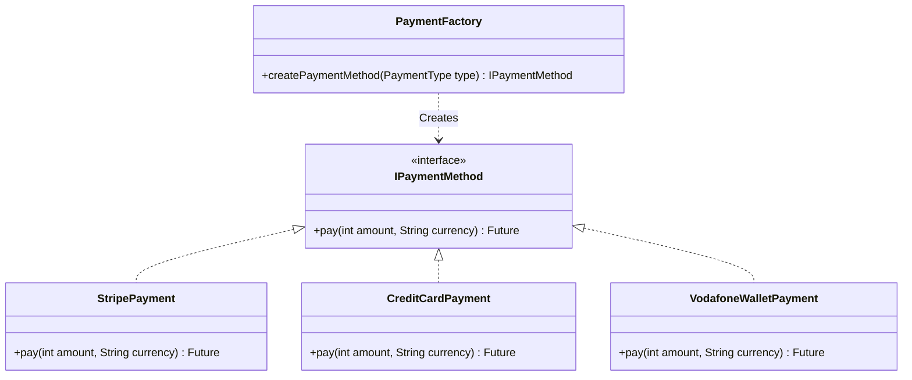

# Play With Payment 💳

A Flutter project demonstrating the integration of various payment methods, designed to show how to structure payment logic using clean architecture principles and factory patterns.

## 🌟 Features

- **Stripe Integration**: Secure credit card payments using `flutter_stripe`.
- **Vodafone Cash (Simulation)**: Simulated mobile wallet payment flow.
- **Credit Card (Simulation)**: Simulated logic for generic credit card payments.
- **Factory Pattern**: Demonstrates the use of the Factory Design Pattern to create payment methods dynamically.
- **Secure Configuration**: Uses `.env` to securely manage API keys.

## 🏗️ Project Architecture

This project implements the **Factory Method Design Pattern** to handle payment method creation. This ensures that the client code (UI) remains decoupled from the specific implementation details of each payment provider.

### Key Components

-   **`IPaymentMethod` (Interface)**: Defines the contract (`pay` method) that all payment methods must implement.
-   **`PaymentFactory`**: A static factory class that takes a `PaymentType` enum and returns the corresponding `IPaymentMethod` instance.
-   **Concrete Strategies**: `StripePayment`, `CreditCardPayment`, and `VodafoneWalletPayment` implement the `IPaymentMethod` interface.

### Class Diagram



## 🛠️ Setup & Installation

1.  **Clone the repository:**
    ```bash
    git clone https://github.com/your-username/play_with_payment.git
    cd play_with_payment
    ```

2.  **Install dependencies:**
    ```bash
    flutter pub get
    ```

3.  **Environment Configuration:**
    Create a `.env` file in the root directory of the project. You can copy the structure below:

    ```properties
    STRIPE_PUBLISHABLE_KEY=pk_test_your_publishable_key
    STRIPE_SECRET_KEY=sk_test_your_secret_key
    ```
    > **Note:** The `.env` file is git-ignored to protect your secrets.

4.  **Run the App:**
    ```bash
    flutter run
    ```

## 📦 Dependencies

- [flutter_stripe](https://pub.dev/packages/flutter_stripe): For Stripe payment integration.
- [flutter_dotenv](https://pub.dev/packages/flutter_dotenv): For loading environment variables.
- [dio](https://pub.dev/packages/dio): For making HTTP requests to the Stripe API (or your backend).

## 📂 Project Structure

- `lib/payment/methods`: Contains the implementation of different payment strategies (`StripePayment`, `CreditCardPayment`, `VodafoneWalletPayment`).
- `lib/payment/payment_factory.dart`: The factory class responsible for creating payment method instances.
- `lib/main.dart`: The main entry point and UI for selecting payment methods.

## 📸 Screenshots

*(Add your screenshots here)*

## 📄 License

This project is licensed under the MIT License - see the [LICENSE](LICENSE) file for details.
